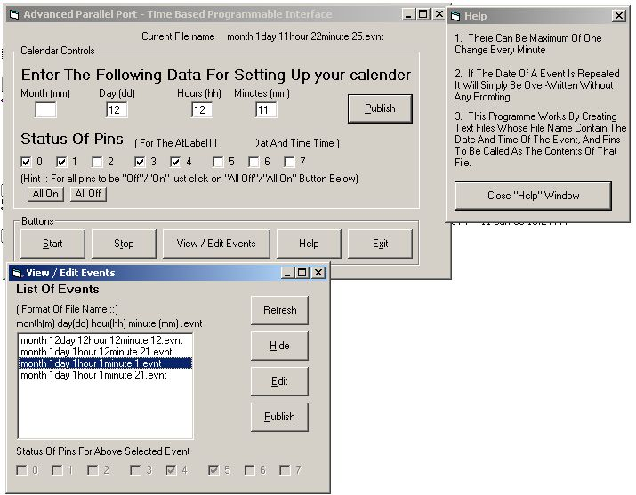



## Advanced Parallel Port \- Time Based Prgm Interface

### Description

This programme will help you manage the status of the 8 output pins in the parallel port.

The users can actually programme it for the future.(ie for the next 364 days from current date!)

The applications for the programme are limitless..(ie. once it is integrated with a circuit that you can construct on your own for under 30 $US..) few example to fire up your imagination are given below... Your AC will start automatically every day during summers, your garden lights will start off automatically in the evening and stop early mornings(even if you go for vacations), your water heater will keep the water heated during winters by the time you get up.
 
### More Info
 

             |
---                |---
**Submitted On**   |2006-01-10 23:18:22
**By**             |[Satish Surath](https://github.com/Planet-Source-Code/PSCIndex/blob/master/ByAuthor/satish-surath.md)
**Level**          |Intermediate
**User Rating**    |4.8 (24 globes from 5 users)
**Compatibility**  |VB 4\.0 \(16\-bit\), VB 4\.0 \(32\-bit\), VB 5\.0, VB 6\.0
**Category**       |[Complete Applications](https://github.com/Planet-Source-Code/PSCIndex/blob/master/ByCategory/complete-applications__1-27.md)
**World**          |[Visual Basic](https://github.com/Planet-Source-Code/PSCIndex/blob/master/ByWorld/visual-basic.md)
**Archive File**   |[Advanced\_P1964291112006\.zip](https://github.com/Planet-Source-Code/satish-surath-advanced-parallel-port-time-based-prgm-interface__1-64007/archive/master.zip)

